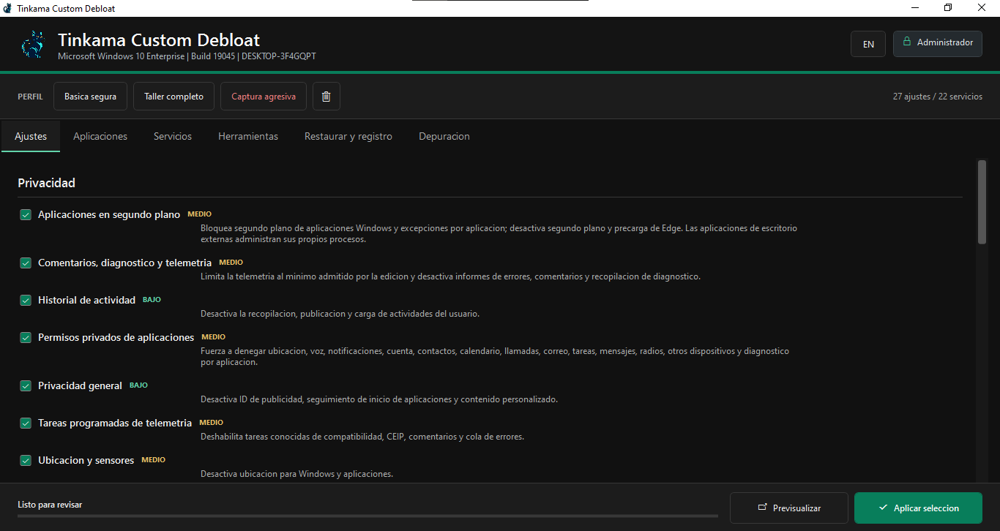

# Tinkama Custom Debloat

Herramienta PowerShell 5.1 + WPF para optimizar equipos con Windows 10 y Windows 11.

### Inicio rapido

Abre Windows PowerShell como administrador y ejecuta:

```powershell
irm https://raw.githubusercontent.com/brunosantunez/tinkama_custom_debloat/main/Install.ps1 | iex
```

Tambien puedes ejecutar `Run.cmd` desde una copia local.

La primera ejecucion permite elegir Espanol o English. El idioma se guarda y puede cambiarse desde la interfaz.

### Funciones

- Perfiles Basica segura, Taller completo y Captura agresiva.
- Privacidad, telemetria, sugerencias, Bing, aplicaciones en segundo plano y diagnostico.
- Eliminacion de aplicaciones integradas y servicios seleccionados.
- Registro en vivo y pestana de depuracion con cambios no aplicados, comandos y motivos.
- Punto de restauracion obligatorio antes de aplicar cambios.
- Restauracion de registro, servicios y energia desde la ultima sesion.

Se mantiene UAC, Microsoft Defender y las politicas permanentes de ejecucion sin cambios. Los perfiles de mayor riesgo solicitan confirmacion adicional.

### Referencias

- [WinUtil](https://github.com/ChrisTitusTech/winutil)
- [Win11Debloat](https://github.com/Raphire/Win11Debloat)
- [FPSBoostPro](https://github.com/itechfever/FPSBoostPro)

## English

PowerShell 5.1 + WPF tool for optimizing Windows 10 and Windows 11 computers.

### Quick start

Open Windows PowerShell as administrator and run:

```powershell
irm https://raw.githubusercontent.com/brunosantunez/tinkama_custom_debloat/main/Install.ps1 | iex
```

You can also run `Run.cmd` from a local copy.

On the first launch, choose Espanol or English. The language is saved and can be changed from the interface.

### Features

- Safe basic, Full workshop and Aggressive capture profiles.
- Privacy, telemetry, suggestions, Bing, background apps and diagnostics controls.
- Removal of selected built-in applications and services.
- Live logs and a debug tab with skipped changes, commands and reasons.
- Mandatory restore point before applying changes.
- Restore registry, services and power settings from the latest session.

Program keeps UAC, Microsoft Defender and permanent execution policies unchanged. Higher-risk profiles require an extra confirmation.

### References

- [WinUtil](https://github.com/ChrisTitusTech/winutil)
- [Win11Debloat](https://github.com/Raphire/Win11Debloat)
- [FPSBoostPro](https://github.com/itechfever/FPSBoostPro)
